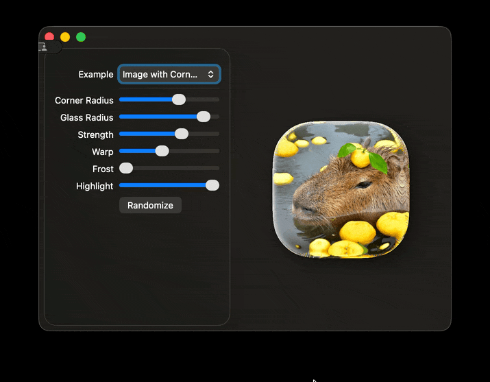

# Clear Glass Effect

A realistic glass refraction effect for SwiftUI using Metal shaders, implementing proper physics-based light bending along surface normals (Snell's law).



## Features

- **Realistic Refraction** - Light bends along surface normals, creating authentic glass distortion
- **Frosted Glass** - Gaussian blur effect
- **Edge Highlights** - Fresnel-based specular highlights on glass edges
- **Metaball Merging** - Organic metaball-style merging of nearby UI elements
- **Chroma Key Support** - Use color-based masking to separate UI backgrounds that use the glass effect form other UI elements.
- **Interactive Controls** - Real-time animatable adjustment of all glass parameters

## Implementation

The effect is built using Metal shaders with SwiftUI's `.layerEffect()` modifier:

### Core Components

1. **clearGlass.metal** - Main shader implementing:
   - Edge detection (alpha or chroma key based)
   - Surface normal calculation
   - Refraction displacement along normals
   - Frosted glass blur
   - Specular highlights

2. **blobMerge shader** - Creates organic merging between elements:
   - Separable box blur in linear color space (horizontal + vertical passes)
   - Proper gamma correction to prevent artificial brightening of dark areas
   - Threshold-based edge sharpening
   - Prevents individual element deformation

3. **GlassContainer** - Compositing view that layers:
   - Background image
   - Masked background with glass effect
   - Chroma key detection layer with optional blob merging

## Examples

The project includes three interactive examples:

- **Image with Corner Radius** - Simple glass effect on a rounded image
- **Text with Image** - Glass refraction through text shapes
- **Glass UI (Todo List)** - Interactive UI with glass effects and blob merging

## Parameters

- **Corner Radius** - Roundness of UI elements
- **Glass Radius** - Edge detection and effect radius
- **Strength** - Refraction intensity
- **Warp** - Refractive index multiplier
- **Frost** - Frosted glass blur amount
- **Highlight** - Edge highlight intensity
- **Blob Merge** - Organic merging radius (Glass UI only)

## Usage

### Using GlassContainer

```swift
GlassContainer(
    backgroundImage: Image("background"),
    radius: 20,
    glassRadius: 5,
    strength: 2.0,
    warp: 0.25,
    frost: 0.3,
    highlight: 0.5,
    chromaKeyColor: .green,
    blobMergeRadius: 10
) {
    // Your UI content with .background(Color.green)
    Text("Glass Effect")
        .background(Color.green)
}
```

### Using the Shader Directly

For simple glass effects, apply the shader directly:

```swift
Image("background")
    .resizable()
    .aspectRatio(contentMode: .fill)
    .cornerRadius(radius)
    .layerEffect(
        ShaderLibrary.clearGlass(
            .float(20),      // cornerRadius
            .float(5),       // glassRadius
            .float(-2.0),    // strength (negative for outward refraction)
            .float(0.25),    // warp
            .float(0.3),     // frost
            .float(0.5),     // highlight
            .color(.clear)   // chromaKey (use .clear for alpha-based detection)
        ),
        maxSampleOffset: CGSize(width: 10, height: 10)
    )
    .shadow(radius: 5)
```

## Requirements

- macOS 14.0+
- SwiftUI
- Metal shader support

## License

MIT
